# 🔐 Smart Contract Vulnerability Classifier with LoRA


<p align="center">
  
</p>

---

## 📝 Project Description

This project fine-tunes **TinyLlama-1.1B** with **LoRA (Low-Rank Adaptation)** to classify vulnerabilities in **Solidity smart contracts**. Given a piece of Solidity code, the model must predict one of 9 vulnerability categories, ranging from reentrancy attacks to integer overflows. Built as part of my PPE at **ECE Paris** (4th year, Data & AI major), the goal is to explore how a small LLM can be adapted for security code analysis using parameter-efficient fine-tuning on a budget GPU setup.

---

## 🧠 What is LoRA?

**LoRA (Low-Rank Adaptation)** is a parameter-efficient fine-tuning technique. Instead of retraining all the weights of a large pre-trained model (very expensive), LoRA **freezes** the original weights and injects small trainable matrices into the attention layers.

<p align="center">
  
</p>

Instead of updating the full weight matrix ΔW (left), LoRA approximates it with two small matrices A and B (right), where `r` (the rank) is a hyperparameter controlling the trade-off between expressiveness and efficiency:

```text
W + ΔW   →   W + A × B
               A ∈ ℝ^(d×r),  B ∈ ℝ^(r×d)   with r << d
```

With `r=16` and `d=2048` (TinyLlama hidden size), LoRA trains only **~0.1% of the total parameters** instead of the full 1.1B. This makes fine-tuning feasible on a budget GPU or a cheap cloud instance.

**QLoRA** goes further by also **quantizing** the base model to 4-bit (NF4), reducing VRAM usage ~4× at almost no quality loss.

---

## ⚙️ Features

  🤖 Fine-tunes **TinyLlama-1.1B-Chat** using **QLoRA** (4-bit NF4 quantization) via PEFT + TRL

  🔍 Classifies **9 vulnerability types** in Solidity code (Reentrancy, Integer Overflow, Delegatecall, etc.)

  ✂️ Handles long contracts via smart **truncation** (first 1500 tokens — where vulnerability patterns appear)

  📊 Full evaluation suite: accuracy, F1 macro/weighted, per-class classification report + confusion matrix

  🐳 **Docker + RunPod** ready — designed to train on cheap cloud GPU (RTX 3090 / A40, budget ≤ 3€)

  ⚖️ Addresses **class imbalance** (97 vs 1000 samples) via stratified splits and weighted metrics

  📈 Training curve visualization with `plot_training.py`

---

## Example Outputs

### Training curves — Run 01

<p align="center">
  
</p>

### Run 01 — Results (full dataset, 3 epochs)

| Metric | Score |
|---|---|
| Accuracy | 22.2% |
| F1 Macro | 10.8% |
| F1 Weighted | 13.3% |
| Valid predictions | 4036 / 4068 |

### 📝 Notes & Observations

- Train loss: ~0.9 → ~0.25 — Val loss: ~0.9 → ~0.28 — the model **converged**, but convergence ≠ learning to discriminate classes
- The model collapses to dominant classes (Safe and Integer overflow) — see confusion matrix in Research Paper section
- F1 macro at 0.108 is barely above random chance (1/9 ≈ 11.1%)

---

## 📄 Research Paper Context — Why This Approach Was Not Retained

> This repository is the **NLP branch** of a broader research project. The approach explored here — fine-tuning a small LLM with LoRA — was ultimately **not retained** in the final paper due to the limitations described below. The final paper uses a different method (**GraphCodeBERT + Data Flow Graphs**, see the [PPE Deliverables](#-ppe-deliverables--poster-paper--defenses) section below).
>
> 📎 [Read the full research paper (PDF)](docs/ppe-paper.pdf)

### Setup

- **Model:** `TinyLlama/TinyLlama-1.1B-Chat-v1.0` — LoRA fine-tuning without quantization
- **Dataset:** `dataset_9l_w_v2 (1).csv` — 4068 Solidity contracts, 9 vulnerability classes
- **Training:** 3 epochs on RunPod (~3€ budget), full dataset

### Results

| Metric | Score |
|---|---|
| Accuracy | 22.2% |
| F1 Macro | 0.108 |
| F1 Weighted | 0.133 |
| Valid format predictions | 4036 / 4068 (99.21%) |

The model did **converge** — train loss dropped from ~0.9 to ~0.25, val loss from ~0.9 to ~0.28. But convergence ≠ learning to discriminate classes. The 22.2% accuracy comes almost entirely from the **Safe** class (1000 samples, the most frequent). F1 macro at 0.108 is barely above random chance (1/9 ≈ 11.1%).

### Confusion matrix analysis

<p align="center">
  
</p>

The model collapses to two dominant predictions:

  ⚠️ **"Safe" (class 8)** — predicted for almost all minority classes

  ⚠️ **"Integer overflow" (class 4)** — second most over-predicted class

Notable patterns:
- **Block number dependency**: 301/405 predicted as Safe, only 104 correct
- **Dangerous delegatecall & Ether frozen**: almost entirely predicted as Integer overflow or Safe
- **Reentrancy**: 168 predicted as Integer overflow, 411 predicted as Safe

### Why it didn't work — Limitations

  🚧 **Prompt-based classification constraint** — The LLM must output a single digit (0–8). This constrains a generative model into a discriminative task. Despite achieving 99.21% format validity (only 32 invalid outputs), the model never truly learned to distinguish vulnerability patterns — it just learned to output numbers.

  🚧 **Treats code as plain text** — TinyLlama assigns equal importance to misleading comments, boilerplate, and critical functions like `transfer()` or `delegatecall()`. There is no structural understanding of Solidity syntax.

  🚧 **Context window bottleneck** — TinyLlama's context window is **2048 tokens**. The median Solidity contract in the dataset is ~7260 characters. Most contracts are truncated, cutting off potentially critical vulnerability patterns at the end.

### Why not just use a bigger model?

<p align="center">
  
</p>

The compute budget is the hard constraint. This run cost ~**3€** for a 1.1B parameter model. Scaling up:

| Model | Parameters | Estimated training cost |
|---|---|---|
| TinyLlama (this work) | 1.1B | ~3€ |
| GPT-4 scale equivalent | ~175B | ~525€ (×175 scaling) |

And for inference-only evaluation on the full dataset (4068 samples), using GPT-4.5:
- Average cost per inference: ~0.31€ (conservative estimate, large prompts)
- Full dataset evaluation: **0.31€ × 4068 ≈ 1261€ minimum**

This makes larger LLM approaches economically non-viable for this research scope.

---

## 📚 PPE Deliverables — Poster, Paper & Defenses

> 🎓 This repository is the **LoRA / NLP exploratory branch** of a larger 6-person PPE at **ECE Paris** (ref. `#ING25-T-479`). The **final retained approach** — *Graph-Aware Transformers* (**GraphCodeBERT** + **Data Flow Graphs**) — reaches **87% F1-score** and **91% recall** on binary vulnerability detection, far beyond the LoRA results above. The complete team deliverables are below.

### 🪧 Poster

<p align="center">
  <a href="docs/ppe-poster.pdf">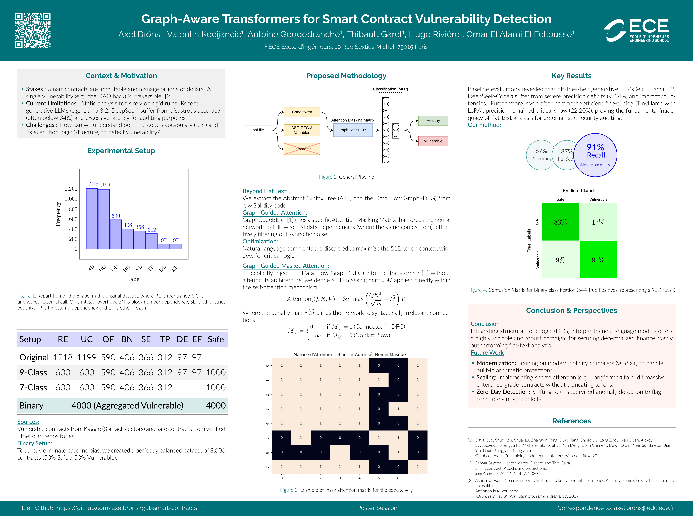</a>
</p>

<p align="center"><em>📎 <a href="docs/ppe-poster.pdf">Open the full poster (PDF)</a></em></p>

---

### 📄 Research Paper — *Graph-Aware Transformers for Smart Contract Vulnerability Detection*

<p align="center">
  <a href="docs/ppe-paper.pdf">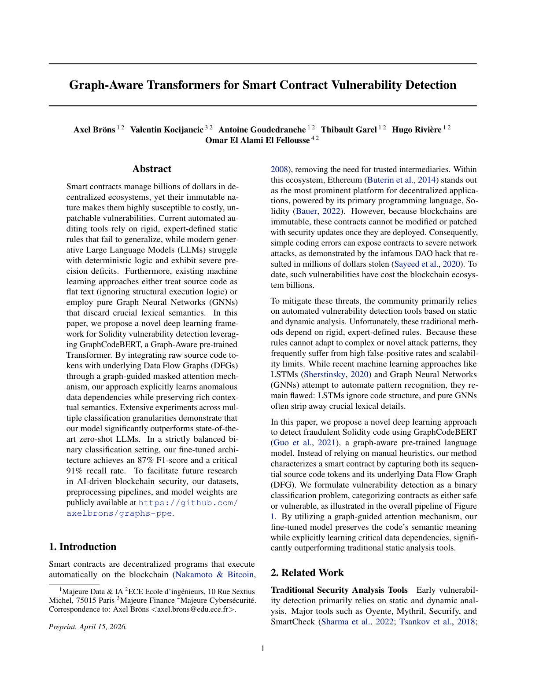</a>
</p>

<p align="center"><em>📎 <a href="docs/ppe-paper.pdf">Read the full paper (PDF, 9 pages)</a></em></p>

#### 📖 Read it page by page

<details>
<summary><strong>Expand the full paper, page by page (9 pages)</strong></summary>

<br>

<p align="center">
  
  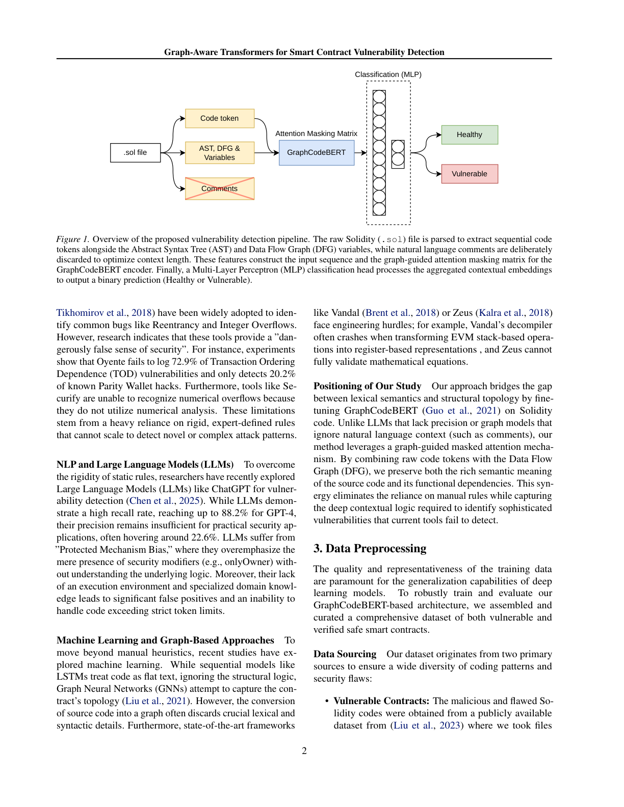
  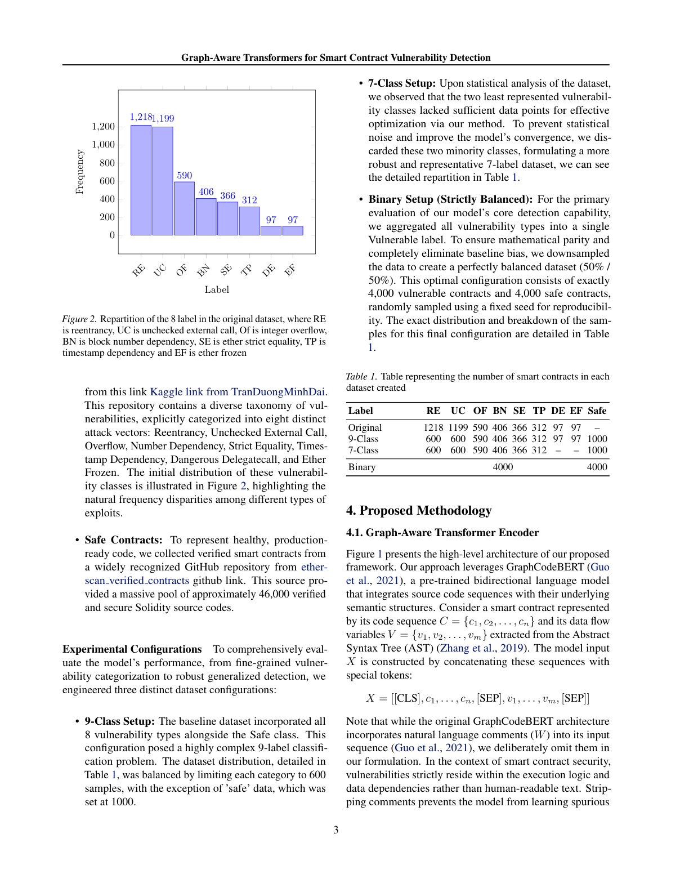
  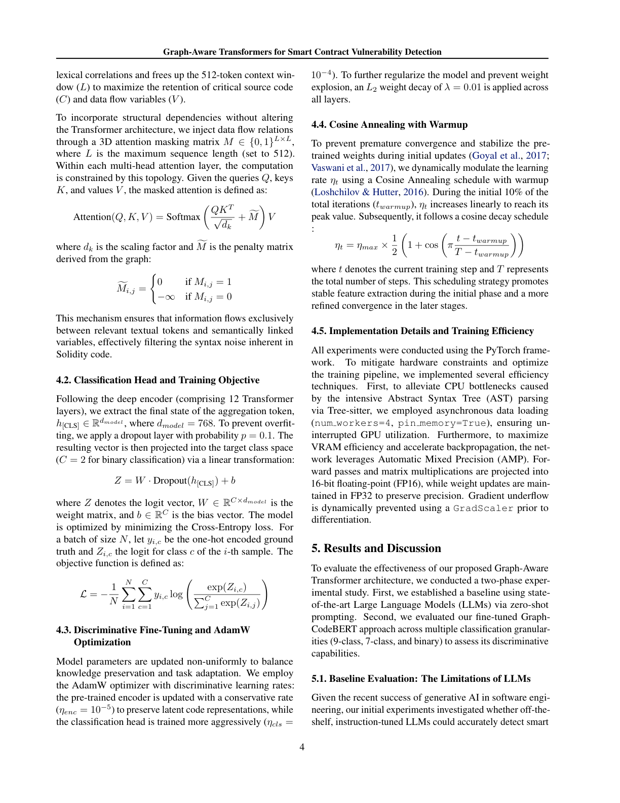
  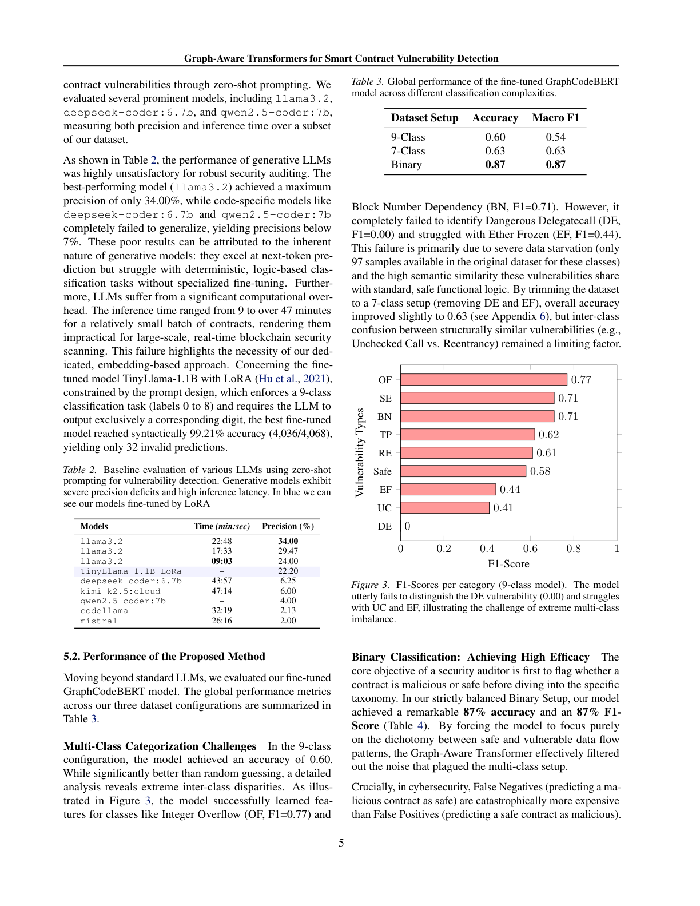
  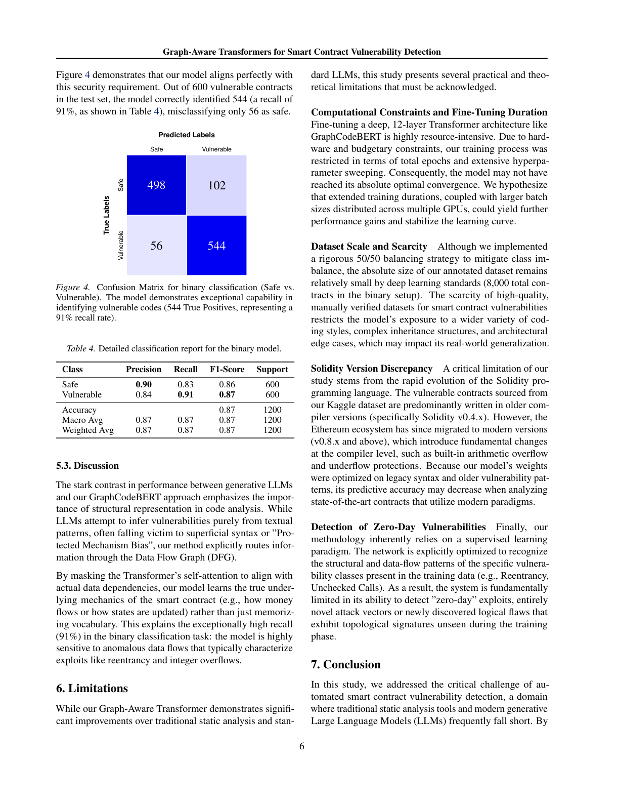
  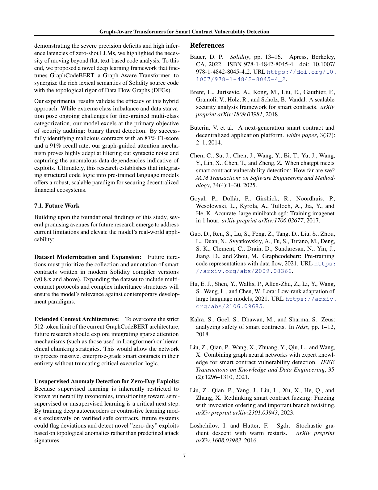
  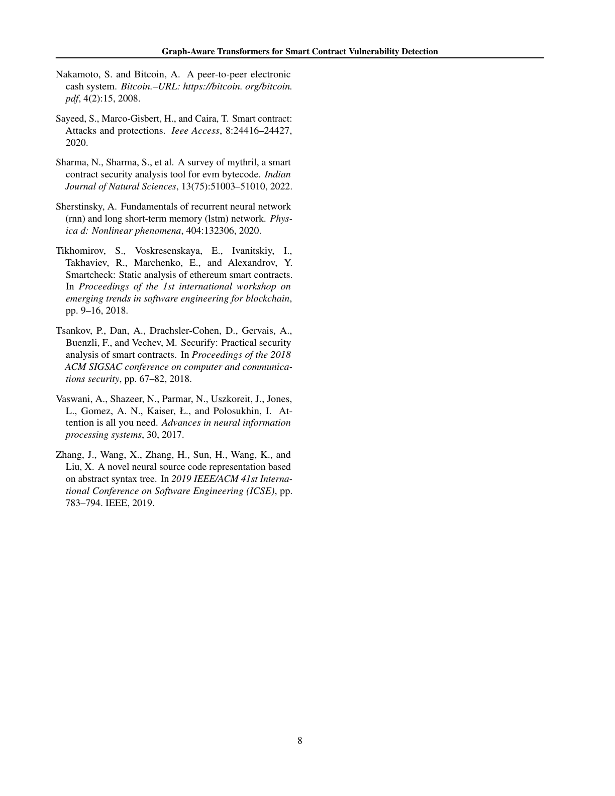
  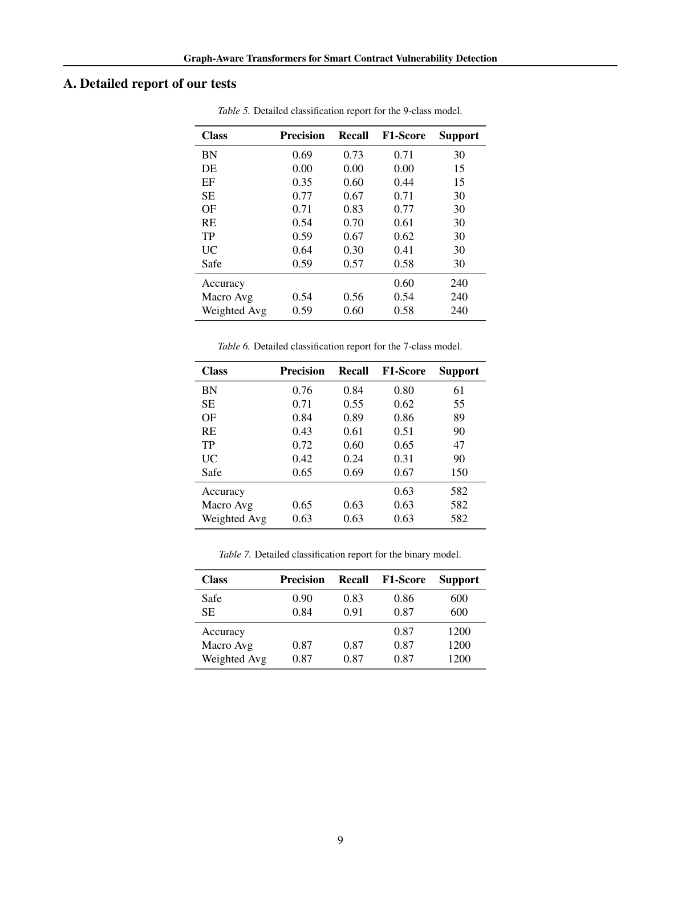
</p>

</details>

<br>

**Abstract (short).** Static auditing tools rely on rigid expert-defined rules, while generative LLMs struggle with deterministic logic and exhibit severe precision deficits. The paper proposes a deep-learning framework built on **GraphCodeBERT**, a graph-aware Transformer that fuses raw Solidity tokens with the underlying **Data Flow Graph (DFG)** through a *graph-guided masked attention* mechanism. On a strictly balanced binary setup, the fine-tuned model reaches an **87% F1-score** and a critical **91% recall**.

---

### 🎤 Oral Defenses

Two milestone defenses (LaTeX Beamer slides) — open the first slide to dive into the full deck:

<div align="center">
<table>
<tr>
<td align="center" width="50%">
<a href="docs/mid-term_defense.pdf">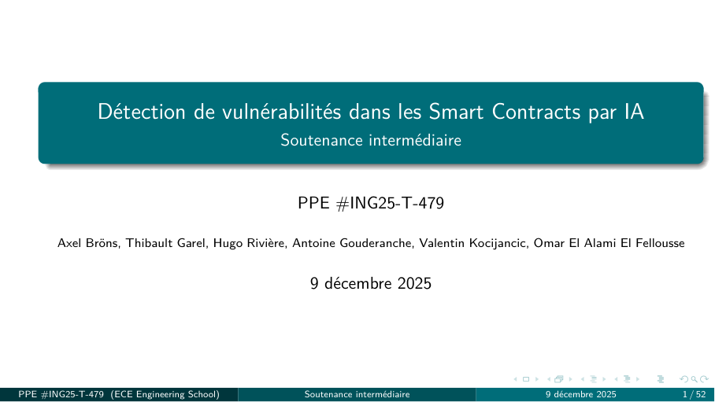</a><br>
<strong>Mid-term defense</strong> — 9 Dec 2025 (52 slides)<br>
<em>📎 <a href="docs/mid-term_defense.pdf">Open the slides (PDF)</a></em>
</td>
<td align="center" width="50%">
<a href="docs/final-term_defense.pdf">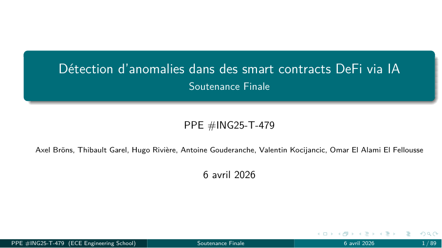</a><br>
<strong>Final defense</strong> — 6 Apr 2026 (89 slides)<br>
<em>📎 <a href="docs/final-term_defense.pdf">Open the slides (PDF)</a></em>
</td>
</tr>
</table>
</div>

---

## ⚙️ How it works

  📥 The CSV dataset (4068 Solidity contracts, 9 labels) is loaded, labels are cleaned from path prefixes

  ✂️ Each contract is tokenized and truncated to **1500 tokens** to fit TinyLlama's 2048-token context window

  🧾 A structured prompt is built using TinyLlama's native chat template (`<|system|>...<|user|>...<|assistant|>`)

  🎯 The model is instructed to output a **single digit (0–8)** representing the vulnerability class

  🔧 LoRA adapters (r=16, α=32) are applied to **q, k, v, o_proj** attention projections only

  ⚡ **QLoRA** (4-bit NF4 + paged AdamW 8-bit) reduces VRAM usage ~4× — fits on a 24 GB cloud GPU

  📈 Training uses **SFTTrainer** (TRL) with cosine LR scheduler, 10% warmup, effective batch size 16

  🔬 Evaluation parses model output (tolerates text around the digit), computes metrics, saves confusion matrix

---

## 🗺️ Schema

```
Solidity Code (raw)
        │
        ▼
   Label Cleaning          (strip path prefix from CSV labels)
        │
        ▼
  Tokenization + Truncation (max 1500 tokens of code)
        │
        ▼
   Prompt Template          (TinyLlama chat format)
   ┌──────────────────────────────────────────────────┐
   │ <|system|> You are a smart contract auditor...   │
   │ <|user|>   [Solidity code here]                  │
   │ <|assistant|> [0-8]                              │
   └──────────────────────────────────────────────────┘
        │
        ▼
  TinyLlama 1.1B + QLoRA (4-bit) + LoRA adapters
        │
        ▼
  Single digit prediction (0–8)
        │
        ▼
  Metrics: Accuracy / F1 macro / F1 weighted / Confusion Matrix
```

### Label mapping

| ID | Vulnerability |
|---|---|
| 0 | Block number dependency |
| 1 | Dangerous delegatecall |
| 2 | Ether frozen |
| 3 | Ether strict equality |
| 4 | Integer overflow |
| 5 | Reentrancy |
| 6 | Timestamp dependency |
| 7 | Unchecked external call |
| 8 | Safe |

---

## 📂 Repository structure

```bash
├── dataset/
│   └── dataset_9l_w_v2 (1).csv   # 4068 Solidity contracts, 9 labels
│
├── results-V1/                    # Evaluation outputs from run-01
│   ├── run-01_confusion_matrix.png
│   ├── run-01_metrics.json
│   └── run-01_predictions.csv
│
├── checkpoint-612-V1/             # LoRA checkpoint saved during training
│
├── docs/                          # PPE deliverables (final)
│   ├── ppe-poster.pdf             # Conference-style poster
│   ├── ppe-paper.pdf              # Research paper (9 pages)
│   ├── mid-term_defense.pdf       # Mid-term defense slides (Dec 2025)
│   └── final-term_defense.pdf     # Final defense slides (Apr 2026)
│
├── img/
│   ├── training_curves_V1.png                      # Loss/accuracy curves from run-01
│   ├── run-01_confusion_matrix.png
│   ├── explication-LoRa.jpeg                       # LoRA vs regular finetuning diagram
│   ├── preview_*.png, paper_page_*.png             # Document previews for this README
│   └── Pourquoi ne pas utiliser un modèle plus gros.pdf  # Cost analysis
│
├── train.py                       # QLoRA fine-tuning with SFTTrainer
├── evaluate.py                    # Full evaluation (metrics + confusion matrix)
├── plot_training.py               # Training curve visualization
│
├── requirements.txt
├── Dockerfile                     # For RunPod deployment
├── Runpod-tuto.md                 # Step-by-step RunPod guide
│
├── LICENSE
└── README.md
```

---

## 💻 Run it on Your PC

Clone the repository and install dependencies:

```bash
git clone https://github.com/Thibault-GAREL/Smart_contract_LoRa.git
cd Smart_contract_LoRa

python -m venv venv # if you don't have a virtual environment
source venv/bin/activate    # Linux / macOS
venv\Scripts\activate       # Windows

pip install -r requirements.txt
```

⚠️ You need a **CUDA-compatible GPU** with at least **16 GB VRAM** for training. For local tests with `--max_samples`, a 6 GB GPU may work at reduced batch size.

### Zero-shot baseline (no training)

```bash
python evaluate.py --baseline --dataset "dataset/dataset_9l_w_v2 (1).csv" --max_samples 100
```

### Quick training test (200 samples, 1 epoch)

```bash
python train.py --max_samples 200 --epochs 1
```

### Full training

```bash
python train.py --epochs 3
```

### Evaluate a trained model

```bash
python evaluate.py --model_dir models/tinyllama-lora_run-01_date-YYYY-MM-DD
```

### On RunPod (recommended)

See [`Runpod-tuto.md`](Runpod-tuto.md) for the full cloud deployment guide. Recommended GPU: RTX 3090 or A40. Budget: ≤ 3€ for a full run.

---

## 📖 Inspiration / Sources

This project is based on:
- 📄 [LoRA: Low-Rank Adaptation of Large Language Models](https://arxiv.org/abs/2106.09685) — Hu et al.
- 📄 [QLoRA: Efficient Finetuning of Quantized LLMs](https://arxiv.org/abs/2305.14314) — Dettmers et al.
- 🤗 [TinyLlama-1.1B-Chat-v1.0](https://huggingface.co/TinyLlama/TinyLlama-1.1B-Chat-v1.0) — Zhang et al.
- 🔧 [PEFT library](https://github.com/huggingface/peft) and [TRL SFTTrainer](https://github.com/huggingface/trl) by HuggingFace

The other part is [**LLM benchmark**](https://github.com/Thibault-GAREL/PPE_LLM_test_Smart_contract).

Big thanks to [Axel Bröns](https://github.com/axelbrons) for his huge contribution for the <a href="docs/ppe-paper.pdf">Paper </a> and his [Graph code](https://github.com/axelbrons/gat-smart-contracts) !

Code created for all the Team by me 😎, Thibault GAREL - [Github](https://github.com/Thibault-GAREL)
